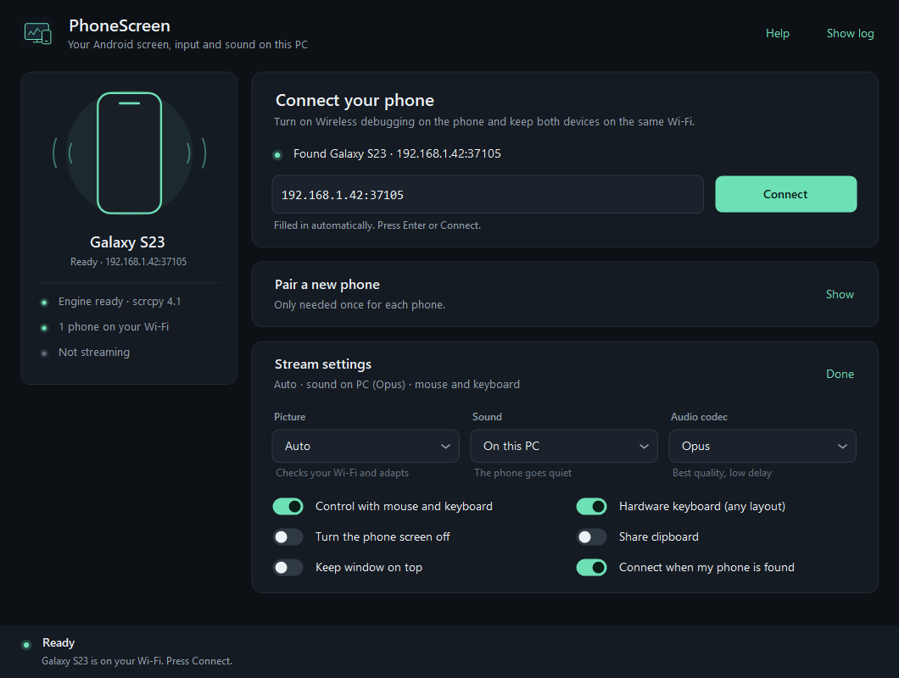

<p align="center"></p>

<p align="center">
  <a href="https://github.com/jytt8u/PhoneScreen/releases/latest"></a>
  <a href="https://github.com/jytt8u/PhoneScreen/actions/workflows/build.yml"></a>
  
  
  <a href="LICENSE"></a>
</p>

<p align="center">See and control your Android phone from Windows, with sound, over your own Wi-Fi.<br>No app on the phone, no account, no cloud.</p>

<p align="center"><a href="https://github.com/jytt8u/PhoneScreen/releases/latest/download/PhoneScreen-1.2.0-win64.zip"></a></p>
<p align="center"><a href="GUIDE.md">Guide</a> · <a href="https://github.com/jytt8u/PhoneScreen/releases/latest">All downloads</a> · <a href="SECURITY.md">Security</a></p>

<p align="center"></p>

PhoneScreen is a small Windows app built around [scrcpy](https://github.com/Genymobile/scrcpy). It opens your phone's screen in a window on the PC: click to tap, drag to swipe, scroll with the wheel, type on your real keyboard, and hear the phone through your PC speakers or headphones.

Download the ZIP, extract it, run **PhoneScreen.exe**. scrcpy is already inside. Not sure about running a ZIP from GitHub? See [Check your download](#check-your-download) or build it yourself in three commands.

## Getting connected

1. On the phone, turn on **Wireless debugging** (Settings → Developer options). Phone and PC need to be on the same network.
2. The first time, tap **Pair device with QR code** on the phone and scan the code PhoneScreen shows. It pairs and connects by itself.
3. Next time just open PhoneScreen and press **Connect**. The phone is found on the network automatically, even after Android changes its port.

No camera? Use **Pair device with pairing code** instead; the address fills in for you, you only type the six digits. Typing an address by hand still works too. The [guide](GUIDE.md) has the details and fixes for common problems.

## What it does

| | |
| :--- | :--- |
| **Finds your phone** | Uses the same network discovery as Android Studio, and connects on its own when the phone you used last shows up. When several phones are around, pick one from a list. |
| **QR pairing** | Scan once and you're done. No IP addresses or ports to copy. |
| **Sound** | Opus or AAC, on the PC only or on both devices (Android 13+). If the phone can't encode Opus, PhoneScreen switches to AAC and restarts the stream on its own. |
| **Stays connected** | Notices a dropped Wi-Fi link within a few seconds and reconnects automatically. The phone doesn't lock itself mid-session. |
| **Smooth on real Wi-Fi** | The Auto profile pings the phone while connecting and picks resolution, bit rate and buffering to match: no delay on a fast link, a little smoothing when the Wi-Fi has spikes. Balanced, Responsive, Weak Wi-Fi and Movies are there if you prefer a fixed setup. |
| **Input** | Mouse and a hardware keyboard that respects your phone's layout, or view-only. Optional clipboard sharing. |
| **Fits in** | Dark interface with a dark title bar, follows Windows display scaling, remembers your phone and settings. |

<details>
<summary>Stream settings</summary>
<p></p>
</details>

**You need** Windows 10 or 11 (x64, .NET Framework 4.8 is built in) and Android 11 or newer. No root and no USB cable.

## Privacy and security

Everything stays on your network. PhoneScreen only talks to private IP addresses, and it refuses to connect unless the phone's port switches to TLS first, so the old unencrypted ADB on port 5555 is never used. Its own ADB server listens on the loopback interface only and is stopped when you close the app.

The scrcpy runtime is pinned to an exact SHA-256, checked file by file before every start, and locked while it runs. Pairing codes are never written to disk. Clipboard sharing is off unless you turn it on. Nothing is recorded.

Pairing gives the PC full ADB access to the phone, which is more than screen mirroring needs. Turn off Wireless debugging when you're finished, and remove the PC under *Paired devices* if you no longer use it. More in [SECURITY.md](SECURITY.md).

## Check your download

Release files aren’t built on anyone’s PC. GitHub Actions builds them from the tagged source in this repository ([release.yml](.github/workflows/release.yml)), downloads scrcpy from its official release, checks every SHA-256 and signs a [build provenance attestation](https://github.com/jytt8u/PhoneScreen/attestations). With the [GitHub CLI](https://cli.github.com/) you can confirm that a file you downloaded came out of that build:

```powershell
gh attestation verify PhoneScreen-1.2.0-win64.zip -R jytt8u/PhoneScreen
```

The same works for `PhoneScreen.exe`. If the file was changed in any way, verification fails.

The bundled scrcpy is the unmodified official build. Its SHA-256, `5b12172b3264b2889f4583ee64752ce832e29bc8b1089dca81093459697165db`, is pinned in [Core.cs](src/Core.cs) and can be compared with the one published on the [scrcpy 4.1 release page](https://github.com/Genymobile/scrcpy/releases/tag/v4.1).

## Building from source

If you’d rather not run a downloaded EXE at all, build it yourself. The C# compiler that ships with Windows is enough; no SDK or NuGet packages. In PowerShell:

```powershell
git clone https://github.com/jytt8u/PhoneScreen.git
cd PhoneScreen
.\build.ps1
```

Then run `PhoneScreen.exe` and click **Install engine**, or run `.\fetch-runtime.ps1`. Both download scrcpy straight from Genymobile’s GitHub and refuse it if the SHA-256 doesn’t match. The app logic lives in `src/`, mostly [Core.cs](src/Core.cs) and [Main.cs](src/Main.cs), if you want to read it first.

To run the tests and build the portable ZIP:

```powershell
.\PhoneScreen.Tests.exe --runtime .
.\PhoneScreen.UiChecks.exe
.\pack.ps1
```

## Credits

PhoneScreen is MIT licensed. The real work is done by scrcpy, made by Romain Vimont and Genymobile, which keeps its own Apache 2.0 license; see [THIRD_PARTY.md](THIRD_PARTY.md) for it and the other bundled components. PhoneScreen is an independent project and is not affiliated with Genymobile.
