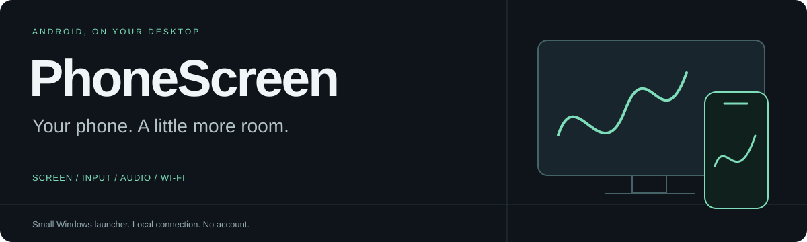
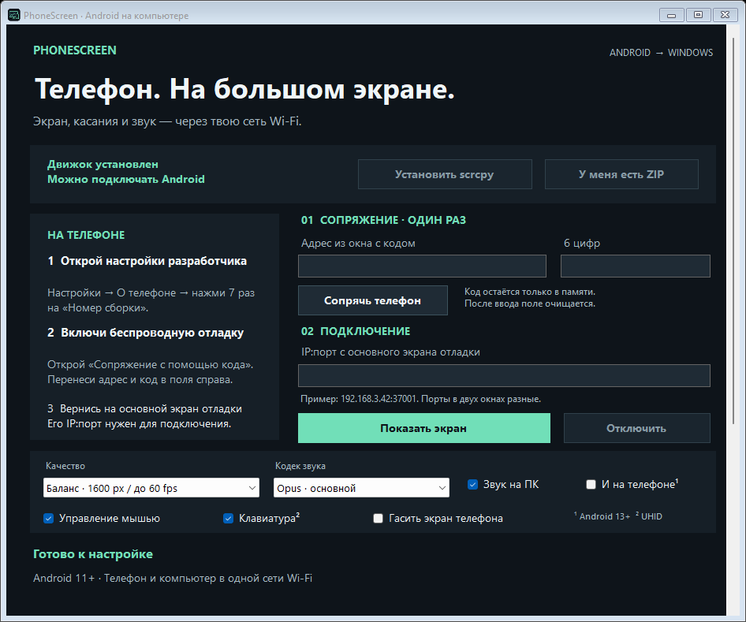

<p align="center"></p>

<p align="center">
  <a href="https://github.com/jytt8u/PhoneScreen/releases/latest"></a>
  <a href="https://github.com/jytt8u/PhoneScreen/actions/workflows/build.yml"></a>
  
  
  <a href="LICENSE"></a>
</p>

**Экран Android на компьютере, управление мышью и клавиатурой, звук через колонки ПК — по Wi-Fi.** PhoneScreen настраивает и запускает [scrcpy](https://github.com/Genymobile/scrcpy) через беспроводную отладку Android. Устанавливать приложение на телефон не нужно.

<p align="center"><a href="https://github.com/jytt8u/PhoneScreen/releases/latest/download/PhoneScreen-1.0.0-win64.zip"><strong>↓ Скачать готовую версию для Windows</strong></a> · <a href="Инструкция.md">Инструкция</a> · <a href="SECURITY.md">Безопасность</a></p>

<p align="center"></p>

## Начать за пару минут

1. Скачай ZIP по ссылке выше, распакуй в обычную папку и открой **PhoneScreen.exe**. В готовом архиве scrcpy уже установлен.
2. На телефоне включи параметры разработчика и **«Беспроводную отладку»**. Телефон и компьютер должны быть в одной сети; ПК можно подключить к роутеру кабелем.
3. Открой **«Сопряжение с помощью кода»**. В PhoneScreen введи адрес, порт и шестизначный код из этого окна. Нажми **«Сопрячь телефон»**.
4. Вернись на основной экран беспроводной отладки. Введи его **адрес и порт подключения**, затем нажми **«Показать экран»**. Порт подключения отличается от порта сопряжения.

В следующий раз сопрягать телефон обычно не требуется. Включи беспроводную отладку и проверь адрес: Android может менять порт после перезапуска.

Предпочитаешь небольшой файл? В [релизе](https://github.com/jytt8u/PhoneScreen/releases/latest) есть отдельный `PhoneScreen.exe`. Нажми **«Установить scrcpy»** — программа сама скачает и проверит официальный архив. Уже скачанный ZIP можно выбрать кнопкой **«У меня есть ZIP»**.

## Что умеет

| Возможность | Как работает |
| :--- | :--- |
| Экран и управление | Отдельное окно Android, клики, свайпы, прокрутка и клавиатура |
| Звук | Opus или AAC, вывод на ПК; одновременный звук на телефоне — Android 13+ |
| Качество | Профили «Баланс», «Слабый Wi-Fi» и «Видео» |
| Подключение | Сопряжение по коду, защищённый транспорт ADB, без USB и root |
| Быстрый запуск | Готовый переносимый архив, без установки SDK, службы и учётной записи |
| Ручная установка | Официальный ZIP scrcpy 4.1 с проверкой SHA-256 |

Нужны **Windows 10/11 x64, .NET Framework 4.8 и Android 11+**. На Android 11 перед запуском разблокируй экран для передачи звука. Некоторые приложения запрещают захват аудио или изображения. Микрофон и звук звонков не входят в обычную трансляцию.

## Защита подключения

PhoneScreen проверяет переход на TLS **в том же соединении, по которому передаются данные**. Старый незашифрованный режим ADB отклоняется. Локальный мост и отдельный сервер ADB слушают только loopback; автоматический поиск и подключение к устройствам отключены.

Загрузчик принимает только HTTPS-ссылки разрешённых серверов GitHub и сверяет заранее закреплённый SHA-256. Перед запуском программа проверяет каждый файл scrcpy по встроенному списку хешей и удерживает файлы от изменения на время работы. Код сопряжения не сохраняется, запись экрана и звука не ведётся, автоматическая синхронизация буфера обмена выключена.

Сопряжение даёт компьютеру доступ через ADB, шире обычного просмотра экрана. Используй свой ПК и доверенную сеть. **Ключи ADB находятся в стандартной папке пользователя Windows `.android` и могут использоваться другими Android-инструментами.** Кнопка «Отключить» завершает сеанс; полный отзыв доступа выполняется на телефоне удалением ПК из списка сопряжённых устройств.

Подробности проверок и ограничения описаны в [SECURITY.md](SECURITY.md).

## Собрать из исходников

На Windows с .NET Framework 4.8, в PowerShell:

```powershell
.\build.ps1
.\PhoneScreen.Tests.exe
```

SDK .NET, NuGet и сторонние библиотеки для сборки оболочки не нужны. Для проверки установленного движка и реального сервера ADB:

```powershell
.\PhoneScreen.Tests.exe --runtime .
```

Отдельная проверка загрузчика с выходом в сеть:

```powershell
.\PhoneScreen.Tests.exe --download
```

На момент выпуска прошли **66 проверок**, включая обмен по TLS-мосту, блокировку незашифрованного ADB, проверку файлов и запуск настоящего ADB на loopback. Проверка загрузки и установки также прошла. Трансляция на физическом телефоне пока не проверена. GitHub Actions собирает приложение и запускает автономные проверки при каждом изменении.

## Лицензии

Оболочка PhoneScreen — [MIT](LICENSE). scrcpy, ADB и медиабиблиотеки сохраняют свои лицензии; описание и ссылки на исходники — [THIRD_PARTY.md](THIRD_PARTY.md). PhoneScreen — самостоятельная оболочка, не официальный продукт Genymobile.
